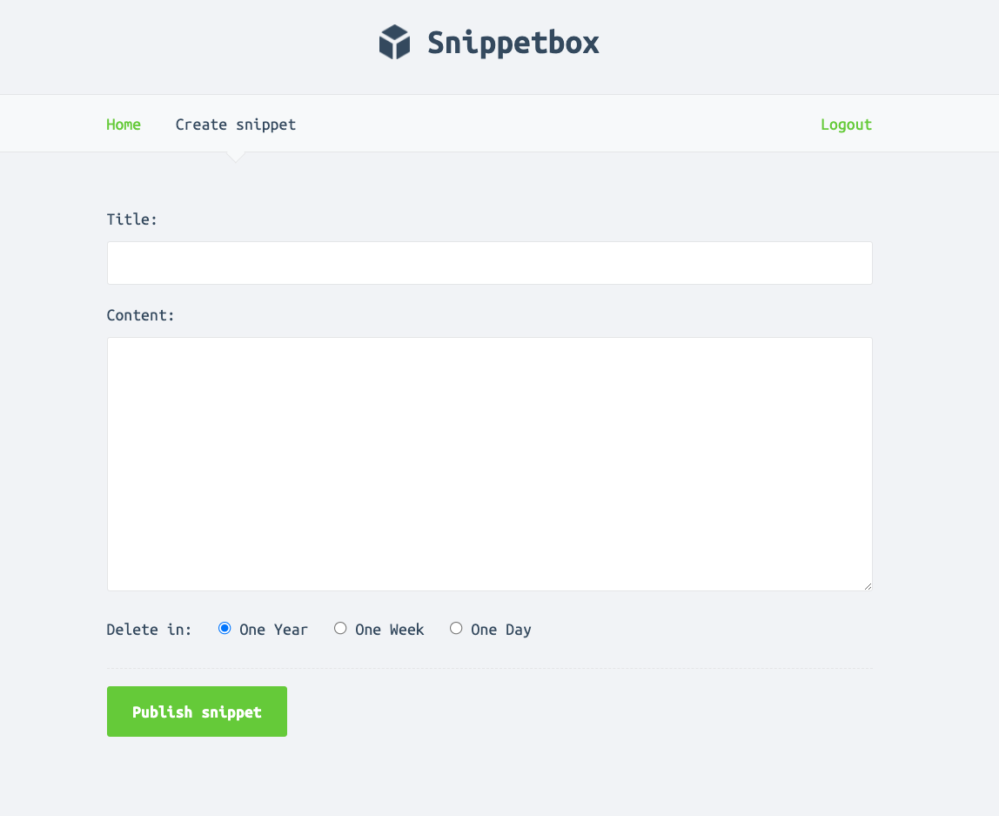

# Snippetbox

### Features
* Sign up
* Login
* Create snippet
* View all unexpired snippets

### Technologies Used
* Golang
* Postgres
* Security best practices for secure auth

This play tool was created by following along with the book [Let's Go](https://lets-go.alexedwards.net/). The difference from the book is that I used Postgres instead of MySQL.

Some screenshots

